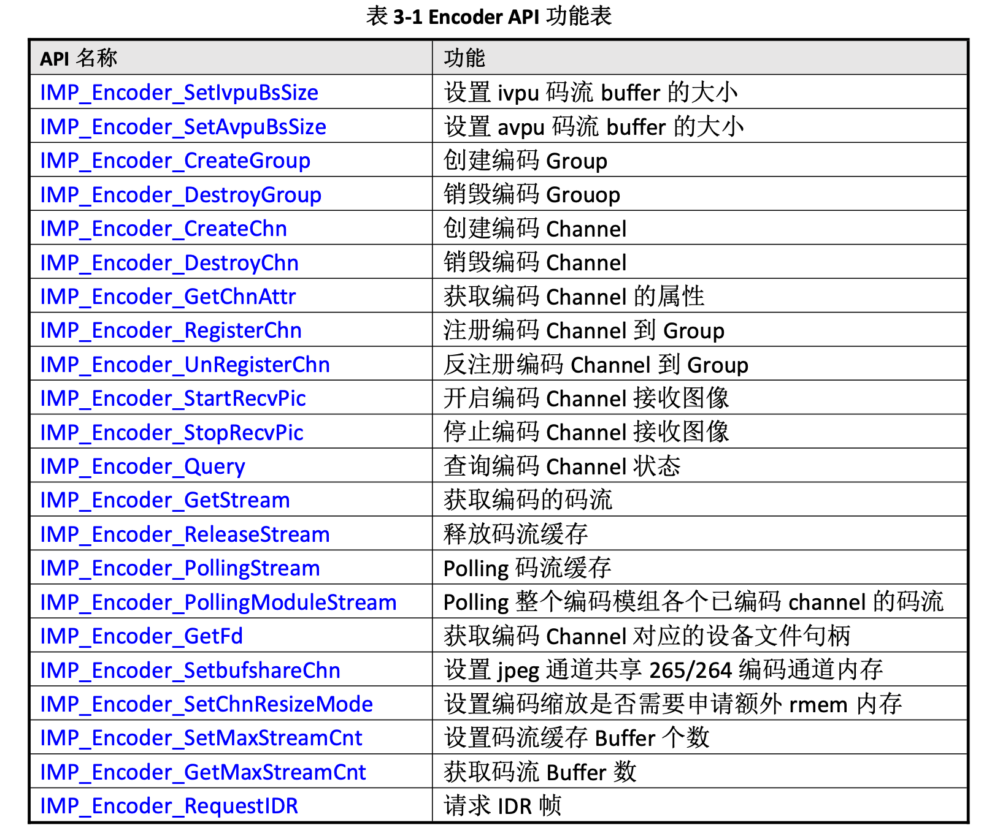
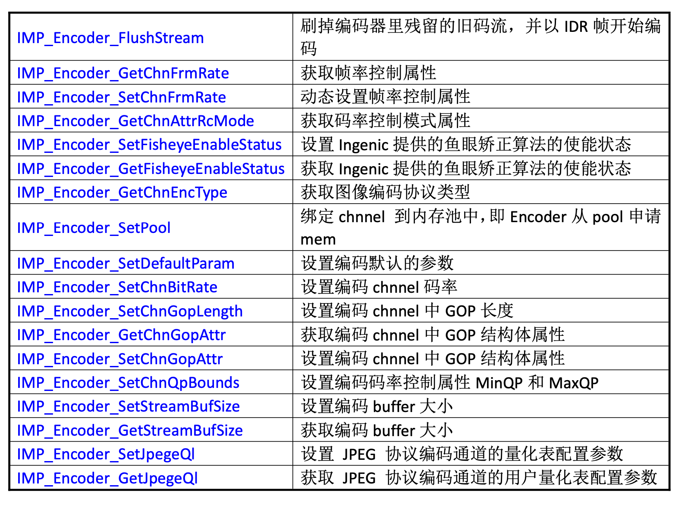

###  base corner
* compiledb -nf make
```shell
compiledb -nf make
```
* main()
* 
* EventLoop()
* 
* ScheduleConnections()
* 
* 


----
# Encoder 模块 API
# IMPFSChnAttr :  通道属性结构体。
```c
typedef struct {
    IMPFSI2DAttr    i2dattr;      // 图像旋转/镜像属性
    int             picWidth;     // 输入图像的原始宽度（像素）
    int             picHeight;    // 输入图像的原始高度（像素）
    IMPPixelFormat  pixFmt;       // 输入图像的像素格式（如NV12/YUV422）
    IMPFSChnCrop    crop;         // 图像裁剪配置
    IMPFSChnScaler  scaler;       // 图像缩放配置
    int             outFrmRateNum; // 输出帧率的分子（如30）
    int             outFrmRateDen; // 输出帧率的分母（如1，表示30fps）
    int             nrVBs;        // 视频缓冲区（Video Buffer）数量
    IMPFSChnType    type;         // 通道类型（如摄像头/文件输入）
    IMPFSChnCrop    fcrop;        // 最终输出裁剪区域（可选）
} IMPFSChnAttr;
```


* IMP_Encoder_SetDefaultParam
```c
int IMP_Encoder_SetDefaultParam(IMPEncoderChnAttr*chnAttr, IMPEncoderProfile profile, IMPEncoderRcMode rcMode,uint16_t uWidth,
uint16_t uHeight, uint32_t frmRateNum,uint32_t frmRateDen,
uint32_t uGopLength,int uMaxSameSenceCnt,int iInitialQP, 
uint32_t uTargetBitRate);
```

* IMPEncoderProfile
```c


/**
* 定义编码Channel码流Profile
  */
  typedef enum {
  IMP_ENC_PROFILE_AVC_BASELINE    = ((PT_H264 << 24) | (IMP_ENC_AVC_PROFILE_IDC_BASELINE)),
  IMP_ENC_PROFILE_AVC_MAIN        = ((PT_H264 << 24) | (IMP_ENC_AVC_PROFILE_IDC_MAIN)),
  IMP_ENC_PROFILE_AVC_HIGH        = ((PT_H264 << 24) | (IMP_ENC_AVC_PROFILE_IDC_HIGH)),
  IMP_ENC_PROFILE_HEVC_MAIN       = ((PT_H265 << 24) | (IMP_ENC_HEVC_PROFILE_IDC_MAIN)),
  IMP_ENC_PROFILE_JPEG            = (PT_JPEG << 24),
  } IMPEncoderProfile;
 
```

* IMPEncoderRcMode

```c

// 定义编码Channel码率控制器模式

  typedef enum {
  ENC_RC_MODE_FIXQP               = 0,	/**< Fixqp 模式 */
  ENC_RC_MODE_CBR                 = 1,	/**< CBR 模式 */
  ENC_RC_MODE_VBR                 = 2,	/**< VBR 模式*/
  ENC_RC_MODE_SMART               = 3,	/**< Smart 模式*/
  ENC_RC_MODE_CVBR                = 4,	/**< CVBR 模式*/
  ENC_RC_MODE_AVBR                = 5,	/**< AVBR 模式*/
  ENC_RC_MODE_INV                 = 6,	/**< INV 模式 */
  } IMPEncoderRcMode;


```


# imp_common.h
```c
/*
 * IMP common data structure header file.
 *
 * Copyright (C) 2014 Ingenic Semiconductor Co.,Ltd
 */

#ifndef __IMP_COMMON_H__
#define __IMP_COMMON_H__

#include <stdint.h>
#include <pthread.h>
#include <linux/videodev2.h>
#include <stdio.h>

#ifdef __cplusplus
#if __cplusplus
extern "C"
{
#endif
#endif /* __cplusplus */

/**
 * @file
 * SDK-T15公共数据结构头文件
 */

/**
 * IMP 设备ID枚举定义.
 */
typedef enum {
	DEV_ID_FS,			/**< 视频源 */
	DEV_ID_ENC,			/**< 编码器 */
	DEV_ID_DEC,			/**< 解码器 */
	DEV_ID_IVS,			/**< 算法 */
	DEV_ID_OSD,			/**< 图像叠加 */
	DEV_ID_FG1DIRECT,		/**< FB FG1Direct */
	DEV_ID_RESERVED_START,
	DEV_ID_RESERVED_END = 23,
	NR_MAX_DEVICES,
} IMPDeviceID;

/**
 * IMPCell枚举定义.
 */
typedef struct {
	IMPDeviceID	deviceID;		/**< 设备ID */
	int			groupID;		/**< 组ID */
	int			outputID;		/**< 输出ID */
} IMPCell;

/**
 * IMP帧图像信息定义.
 */
typedef struct {
	int index;			/**< 帧序号 */
	int pool_idx;			/**< 帧所在的Pool的ID */

	uint32_t width;			/**< 帧宽 */
	uint32_t height;		/**< 帧高 */
	uint32_t pixfmt;		/**< 帧的图像格式 */
	uint32_t size;			/**< 帧所占用空间大小 */

	uint32_t phyAddr;		/**< 帧的物理地址 */
	uint32_t virAddr;		/**< 帧的虚拟地址 */
	uint32_t direct_phyAddr; 	/**< 帧的直通地址 */

	void *pool;
	int64_t timeStamp;		/**< 帧的时间戳 */
	uint32_t priv[0];		/* 私有数据 */
} IMPFrameInfo;

/**
 * IMP帧时间参数.
 */
typedef struct {
	uint64_t ts;						/**< 时间 */
	uint64_t minus;						/**< 下限 */
	uint64_t plus;						/**< 上限 */
} IMPFrameTimestamp;

/**
 * 编解码协议类型
 */
typedef enum {
	PT_JPEG,					/**< JPEG图像协议类型 */
	PT_H264,					/**< H264视频协议类型 */
	PT_H265,					/**< H265视频协议类型 */
} IMPPayloadType;

/**
 * IMP图像格式定义.
 */
typedef enum {
	PIX_FMT_YUV420P,   /**< planar YUV 4:2:0, 12bpp, (1 Cr & Cb sample per 2x2 Y samples) */
	PIX_FMT_YUYV422,   /**< packed YUV 4:2:2, 16bpp, Y0 Cb Y1 Cr */
	PIX_FMT_UYVY422,   /**< packed YUV 4:2:2, 16bpp, Cb Y0 Cr Y1 */
	PIX_FMT_YUV422P,   /**< planar YUV 4:2:2, 16bpp, (1 Cr & Cb sample per 2x1 Y samples) */
	PIX_FMT_YUV444P,   /**< planar YUV 4:4:4, 24bpp, (1 Cr & Cb sample per 1x1 Y samples) */
	PIX_FMT_YUV410P,   /**< planar YUV 4:1:0,  9bpp, (1 Cr & Cb sample per 4x4 Y samples) */
	PIX_FMT_YUV411P,   /**< planar YUV 4:1:1, 12bpp, (1 Cr & Cb sample per 4x1 Y samples) */
	PIX_FMT_GRAY8,     /**<	   Y	    ,  8bpp */
	PIX_FMT_MONOWHITE, /**<	   Y	    ,  1bpp, 0 is white, 1 is black, in each byte pixels are ordered from the msb to the lsb */
	PIX_FMT_MONOBLACK, /**<	   Y	    ,  1bpp, 0 is black, 1 is white, in each byte pixels are ordered from the msb to the lsb */

	PIX_FMT_NV12,      /**< planar YUV 4:2:0, 12bpp, 1 plane for Y and 1 plane for the UV components, which are interleaved (first byte U and the following byte V) */
	PIX_FMT_NV21,      /**< as above, but U and V bytes are swapped */

	PIX_FMT_RGB24,     /**< packed RGB 8:8:8, 24bpp, RGBRGB... */
	PIX_FMT_BGR24,     /**< packed RGB 8:8:8, 24bpp, BGRBGR... */

	PIX_FMT_ARGB,      /**< packed ARGB 8:8:8:8, 32bpp, ARGBARGB... */
	PIX_FMT_RGBA,	   /**< packed RGBA 8:8:8:8, 32bpp, RGBARGBA... */
	PIX_FMT_ABGR,	   /**< packed ABGR 8:8:8:8, 32bpp, ABGRABGR... */
	PIX_FMT_BGRA,	   /**< packed BGRA 8:8:8:8, 32bpp, BGRABGRA... */

	PIX_FMT_RGB565BE,  /**< packed RGB 5:6:5, 16bpp, (msb)	  5R 6G 5B(lsb), big-endian */
	PIX_FMT_RGB565LE,  /**< packed RGB 5:6:5, 16bpp, (msb)	  5R 6G 5B(lsb), little-endian */
	PIX_FMT_RGB555BE,  /**< packed RGB 5:5:5, 16bpp, (msb)1A 5R 5G 5B(lsb), big-endian, most significant bit to 0 */
	PIX_FMT_RGB555LE,  /**< packed RGB 5:5:5, 16bpp, (msb)1A 5R 5G 5B(lsb), little-endian, most significant bit to 0 */

	PIX_FMT_BGR565BE,  /**< packed BGR 5:6:5, 16bpp, (msb)	 5B 6G 5R(lsb), big-endian */
	PIX_FMT_BGR565LE,  /**< packed BGR 5:6:5, 16bpp, (msb)	 5B 6G 5R(lsb), little-endian */
	PIX_FMT_BGR555BE,  /**< packed BGR 5:5:5, 16bpp, (msb)1A 5B 5G 5R(lsb), big-endian, most significant bit to 1 */
	PIX_FMT_BGR555LE,  /**< packed BGR 5:5:5, 16bpp, (msb)1A 5B 5G 5R(lsb), little-endian, most significant bit to 1 */

	PIX_FMT_0RGB,      /**< packed RGB 8:8:8, 32bpp, 0RGB0RGB... */
	PIX_FMT_RGB0,	   /**< packed RGB 8:8:8, 32bpp, RGB0RGB0... */
	PIX_FMT_0BGR,	   /**< packed BGR 8:8:8, 32bpp, 0BGR0BGR... */
	PIX_FMT_BGR0,	   /**< packed BGR 8:8:8, 32bpp, BGR0BGR0... */

	PIX_FMT_BAYER_BGGR8,    /**< bayer, BGBG..(odd line), GRGR..(even line), 8-bit samples */
	PIX_FMT_BAYER_RGGB8,    /**< bayer, RGRG..(odd line), GBGB..(even line), 8-bit samples */
	PIX_FMT_BAYER_GBRG8,    /**< bayer, GBGB..(odd line), RGRG..(even line), 8-bit samples */
	PIX_FMT_BAYER_GRBG8,    /**< bayer, GRGR..(odd line), BGBG..(even line), 8-bit samples */

	PIX_FMT_RAW,

	PIX_FMT_HSV,

	PIX_FMT_NB,
	PIX_FMT_YUV422,
	PIX_FMT_YVU422,
	PIX_FMT_UVY422,
	PIX_FMT_VUY422,
	PIX_FMT_RAW8,
	PIX_FMT_RAW16,
} IMPPixelFormat;

/**
 * IMP点坐标信息.
 */
typedef struct {
	int		x;			/**<横坐标  */
	int		y;			/**<纵坐标  */
} IMPPoint;

/**
 * IMP 矩形区域信息.
 *
 * 如下图所示，当p0(100,100)作为起始点，要使width和height为100时，则p1为(199,199)
 * width = abs(p1.x-p0.x)+1   height = abs(p1.y-p0.y)+1  点数等于距离+1
 * p0(100,100) _____100______
 *            |              |
 *            |              |
 *         100|              |
 *            |              |
 *            |______________|
 *                           p1(199,199)
 *
 */
typedef struct {
	IMPPoint		p0;		/**<左上角点坐标信息  */
	IMPPoint		p1;		/**<右下角点坐标信息  */
} IMPRect;

typedef struct {
	IMPPoint		p0;		/**<横线：直线的左端点 竖线：直线的右端点 */
}IMPLine;

static inline int calc_pic_size(int width, int height, IMPPixelFormat imp_pixfmt)
{
	int bpp1 = 0, bpp2 = 1,size;

#define BPP(FMT, A, B) case FMT: bpp1 = A;bpp2 = B;break
	switch (imp_pixfmt) {
		BPP(PIX_FMT_NV12, 3, 2);
		BPP(PIX_FMT_YUV422, 2, 1);   /**< semiplanar YUV 4:2:2, 2, 1); 16bpp */
		BPP(PIX_FMT_YVU422, 2, 1);	  /**< semiplanar YUV 4:2:2, 2, 1); 16bpp */
		BPP(PIX_FMT_UVY422, 2, 1);	  /**< semiplanar YUV 4:2:2, 2, 1); 16bpp */
		BPP(PIX_FMT_VUY422, 2, 1);	  /**< semiplanar YUV 4:2:2, 2, 1); 16bpp */
		BPP(PIX_FMT_RAW8, 1, 1);
		BPP(PIX_FMT_RAW16, 2, 1);
		BPP(PIX_FMT_YUYV422, 2, 1);
		BPP(PIX_FMT_UYVY422, 2, 1);
		BPP(PIX_FMT_RGB565BE, 2, 1);
		BPP(PIX_FMT_BGR0, 4, 1);

	default: break;
	}
#undef BPP
	size = width * height * bpp1 / bpp2;

	return size;
}

static inline const char *fmt_to_string(IMPPixelFormat imp_pixfmt)
{
	static const char *nv12 = "nv12";
	static const char *yuyv422 = "yuyv422";

	switch (imp_pixfmt) {
	case PIX_FMT_NV12:
		return nv12;
	case PIX_FMT_YUV422:
		return yuyv422;
	default:
		break;
	}
	return NULL;
}

void nv12dump_continues(IMPFrameInfo *frame,char *pst);
void NV12dump(IMPFrameInfo *frame,char *pst);
int64_t sample_gettimeus(void);

#ifdef __cplusplus
#if __cplusplus
}
#endif
#endif /* __cplusplus */

#endif /* __IMP_COMMON_H__ */

```


# 参考
* https://github.com/rinetd/hi3516dv300-rtsp-h264